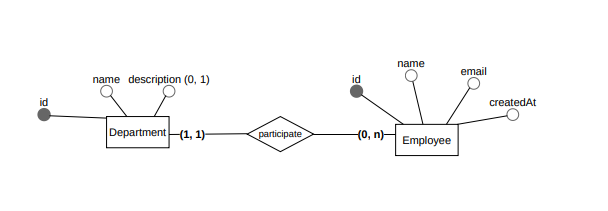
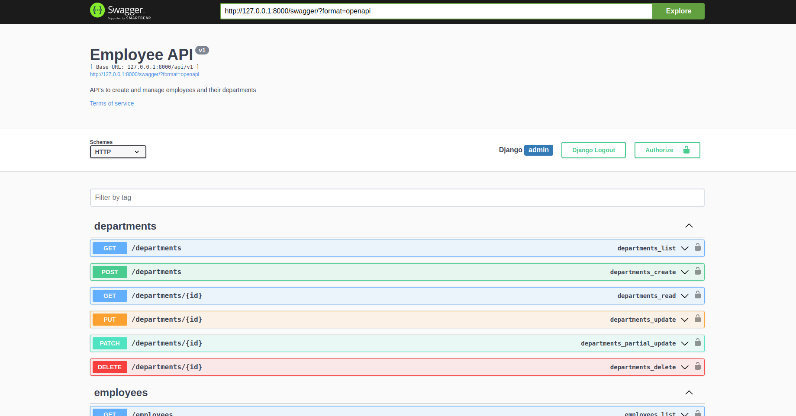

# Aplicativo para gerir empregados

## Sobre o projeto

Este projeto é um aplicativo para gerir empregados, onde é possível cadastrar, editar, remover e listar empregados.

Também foi adicionado sistema para gerir departamentos, sendo possível realizar as mesmas operações que são possíveis com empregados.

### Modelos

## Como executar o projeto

### Pré-requisitos

- Python >= 3.6

- Pip

### Instalação

1. Clone o repositório (`git clone URL`)
2. Instale as dependências (`pip install -r requirements.txt`)
3. Crie o arquivo `.env`, onde deve a chave `SECRET_KEY` com o conteúdo da chave secreta do Django (exemplo: `SECRET_KEY='super_secret123'`)
4. Caso queira sistema de autenticação, insira a chave `AUTH_VARIABLE` como `True` dentro da `.env` e crie um usuário para ter acesso às API's (`python manage.py createsuperuser`)
5. Criar as tabelas no banco de dados (`python manage.py migrate`)
6. Execute o servidor (`python manage.py runserver`)

## API's

A aplicação conta com uma página Swagger (documentação da API) para consultar, a URL para consultar o Swagger da sua aplicação é `/swagger/`.

### Empregados

- Listar empregados: `GET /api/v1/employees/`
  > O retorno da lista é paginada, você pode passar offset para o número da página e limit para limitar o número de retorno na lista (exemplo: `/api/v1/employees?limit=10&offset=0`)
- Criar empregado: `POST /api/v1/employees/`
- Editar empregado: `PUT /api/v1/employees/{id}/`
- Remover empregado: `DELETE /api/v1/employees/{id}/`

### Departamentos

- Listar departamentos: `GET /api/v1/departments/`
  > O retorno da lista é paginada, você pode passar offset para o número da página e limit para limitar o número de retorno na lista (exemplo: `/api/v1/employees?limit=10&offset=0`)
- Criar departamento: `POST /api/v1/departments/`
- Editar departamento: `PUT /api/v1/departments/{id}/`
- Remover departamento: `DELETE /api/v1/departments/{id}/`

### Login (opcional)

- Login: `POST /api-auth/login/`
- Logout: `POST /api-auth/logout/`

### Testes automatizados

Os testes presentes no sistema são simples: testam cada operação do CRUD (deletar, criar, listar e atualizar) para as API's dos departamentos e dos empregados. Também é feito pequenos testes com offset e limit para garantir que a paginação está funcionando corretamente.
